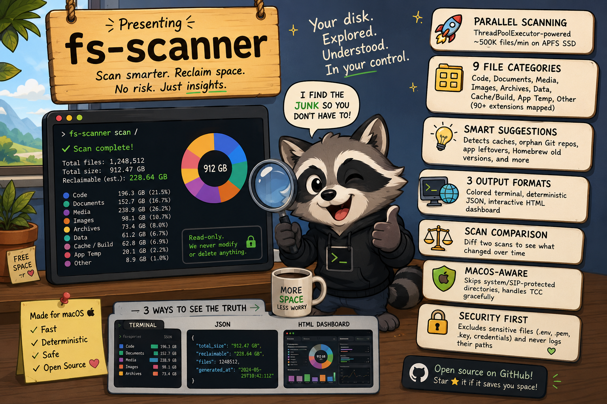

# fs-scanner

<p align="center">
  
</p>

A deterministic, read-only CLI tool that scans the filesystem, catalogs files by type and size, and suggests reclaimable disk space. It never modifies or deletes any file.

Cross-platform core with OS-specific suggestion modules (macOS fully supported, Windows planned).

## Features

- **Parallel scanning** — ThreadPoolExecutor-based walker, ~500K files/min on APFS SSD
- **9 file categories** — Code, Documents, Media, Images, Archives, Data, Cache/Build, App Temp, Other (90+ extensions mapped)
- **Smart suggestions** — detects caches, orphan Git repos, app leftovers, Homebrew old versions, and more
- **3 output formats** — colored terminal, deterministic JSON, interactive HTML dashboard
- **Scan comparison** — diff two scans to see what changed over time
- **macOS-aware** — skips system/SIP-protected directories, handles TCC gracefully
- **Cross-platform core** — scanner, categorizer, reporters work on any OS; OS-specific suggestions via platform layer
- **Security** — excludes sensitive files (.env, .pem, .key, credentials), never logs their paths

## Installation

```bash
# Clone and install
git clone git@github.com:alessandrodinisio-ai/fs-scanner.git
cd fs-scanner
uv venv --python 3.12 .venv
source .venv/bin/activate
uv pip install -e .
```

## Usage

```bash
# Basic scan (home directory, terminal output)
fs-scanner

# Scan a specific path with options
fs-scanner ~/Workspace --depth 3 --min-size 1MB --top 20

# Generate HTML dashboard
fs-scanner --format html ~

# Generate JSON report
fs-scanner --format json ~

# Compare with previous scan
fs-scanner --compare output/scan_20260618_120000.json ~

# Dry run (show what would be scanned)
fs-scanner --dry-run ~

# Disable suggestions
fs-scanner --no-suggestions ~

# Exclude patterns
fs-scanner --exclude "*.log" --exclude "node_modules" ~/Projects
```

## CLI Options

| Option | Description |
|--------|-------------|
| `PATH` | Root directory to scan (default: `~`) |
| `--depth N` | Max traversal depth |
| `--min-size SIZE` | Min file size filter (`100B`, `1KB`, `50MB`, `2GB`) |
| `--top N` | Show top N heaviest directories (default: 20) |
| `--format` | `terminal` (default), `json`, `html` |
| `--exclude PATTERN` | Glob pattern to exclude (repeatable) |
| `--no-suggestions` | Disable cleanup suggestions |
| `--compare PATH` | Compare with previous JSON scan |
| `--dry-run` | Show scan plan without executing |
| `--verbose` | Log each directory as entered |

## Output

Every scan automatically saves a timestamped JSON report to `output/`:

```
output/
├── scan_20260619_092953.json
├── scan_20260619_092953.html   (if --format html)
```

## Suggestion Modules

| Module | What it detects |
|--------|-----------------|
| `cache_rules` | macOS caches, Maven, npm, pip, pnpm, Podman, Thunderbird, JetBrains |
| `git_repos` | Orphan Git repos (no commits) and bloated loose objects |
| `homebrew` | Old formula versions and download cache |
| `app_leftovers` | Residual files from uninstalled apps, dead LaunchAgents |
| `xcode` | DerivedData, old archives (>90 days), unused simulators |
| `mail` | Apple Mail attachment cache |
| `icloud` | Locally downloaded iCloud files (evictable) |
| `timemachine` | Local Time Machine snapshots |

Each suggestion includes:
- Reclaimable size
- Risk level (`SAFE`, `CAUTION`, `RISKY`)
- Cleanup command to run

## HTML Dashboard

The interactive dashboard includes:
- **Stats cards** — total size, file count, categories, reclaimable space
- **Suggestions tab** — prioritized list with risk badges and cleanup commands
- **Treemap** — zoomable D3.js visualization of disk usage by directory
- **Categories** — donut chart with per-category breakdown
- **Top Files** — sortable/filterable table with search
- **Heatmap** — file modification dates, highlights "ghost files" (>50MB, >2yr old)

Fully self-contained (D3.js embedded inline, no CDN dependencies).

## Architecture

```
CLI (click) → Config → Scanner (parallel) → Catalog → Suggestions → Reporter
```

```
src/fs_scanner/
├── cli.py              # Click CLI + pipeline orchestration
├── config.py           # Configuration loading & size parsing
├── progress.py         # Rich progress bar
├── platform/
│   ├── __init__.py     # Auto-detect OS, export current platform
│   ├── base.py         # Cross-platform defaults (Maven, Gradle, npm, Docker)
│   └── macos.py        # macOS-specific (~/Library, Homebrew, TCC workaround)
├── scanner/
│   ├── walker.py       # Parallel filesystem walker
│   ├── exclusions.py   # System/sensitive file rules (uses platform layer)
│   └── metadata.py     # Spotlight mdls integration
├── catalog/
│   ├── models.py       # Core dataclasses
│   └── categorizer.py  # Extension → category mapping
├── suggestions/
│   ├── cache_rules.py  # Cache/temp detection (platform-aware)
│   ├── git_repos.py    # Git orphan detection
│   ├── homebrew.py     # Homebrew cleanup
│   ├── app_leftovers.py # Uninstalled app residuals
│   ├── xcode.py        # Xcode artifacts
│   ├── mail.py         # Mail/Thunderbird attachments
│   ├── icloud.py       # iCloud local copies
│   └── timemachine.py  # Time Machine snapshots
├── reporters/
│   ├── terminal.py     # Rich colored output
│   ├── json_report.py  # Deterministic JSON
│   ├── html_report.py  # HTML dashboard
│   └── comparison.py   # Scan diff
└── dashboard/
    ├── generator.py    # HTML template + D3.js code
    └── assets/d3.min.js
```

## Safety Guarantees

- **Read-only**: never deletes, moves, renames, or modifies any file
- **No network**: makes zero network calls during execution
- **No symlink traversal**: records symlinks but never follows them
- **Graceful errors**: permission denied → log warning and continue, never crash
- **Deterministic**: same filesystem state → byte-identical JSON output

## Platform Support

The codebase is split into **cross-platform** and **OS-specific** layers:

| Layer | File | What it handles |
|-------|------|-----------------|
| Cross-platform | `platform/base.py` | Maven, Gradle, npm, Docker, Ollama caches; sensitive file patterns |
| macOS-specific | `platform/macos.py` | ~/Library paths, Homebrew, TCC/SIP workaround via `du` subprocess |

The scanner, categorizer, reporters, dashboard, and Git detection work on any OS.
To add Windows support, create `platform/windows.py` — see `docs/proposal-windows-support.md`.

## Requirements

- Python >= 3.10
- Dependencies: `click`, `rich`, `pyyaml`, `jinja2`

### macOS-specific features

Full suggestion modules (Homebrew, Xcode, iCloud, Time Machine, Mail, App Leftovers) require macOS.
For full access to protected directories (Documents, Downloads, Photos), grant "Full Disk Access" to your terminal app in System Settings > Privacy & Security.

### Cross-platform

The scanner, categorizer, file table, JSON/HTML reports, Git detection, and cache rules for Maven/Gradle/npm/Docker work on any OS (macOS, Linux, Windows).

## License

MIT
